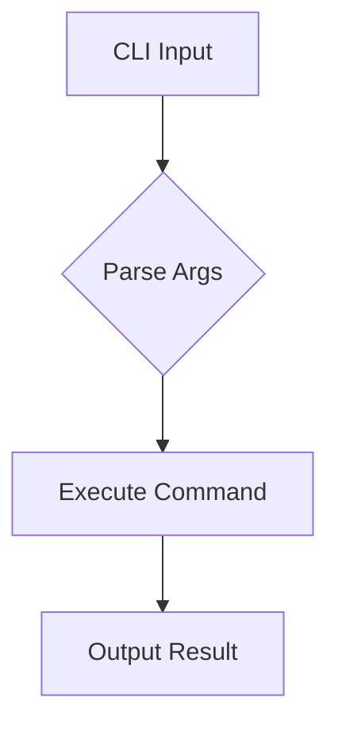

# mdbook Preprocessors

Extend mdbook with preprocessors.

## Built-in Preprocessors

### Links Preprocessor

Handles `{{#include}}` and other directives.

```toml
[preprocessor.links]
```

### Index Preprocessor

Creates index from SUMMARY.md.

```toml
[preprocessor.index]
```

## Popular Third-Party Preprocessors

### mdbook-mermaid

Diagrams in documentation.

```bash
cargo install mdbook-mermaid
mdbook-mermaid install docs/
```

```toml
[preprocessor.mermaid]
command = "mdbook-mermaid"
```

````markdown

````

### mdbook-toc

Auto-generate table of contents.

```bash
cargo install mdbook-toc
```

```toml
[preprocessor.toc]
command = "mdbook-toc"
```

```markdown
<!-- toc -->

# Chapter Title

Content here...
```

### mdbook-admonish

Warning/info boxes.

```bash
cargo install mdbook-admonish
mdbook-admonish install docs/
```

```toml
[preprocessor.admonish]
command = "mdbook-admonish"
```

```markdown
```admonish warning
Be careful with this command!
```

```admonish info title="Note"
This is informational.
```
```

### mdbook-linkcheck

Validate all links.

```bash
cargo install mdbook-linkcheck
```

```toml
[preprocessor.linkcheck]
command = "mdbook-linkcheck"
```

## Writing Custom Preprocessors

### Basic Structure

```rust
// src/main.rs
use mdbook::preprocess::{Preprocessor, PreprocessorContext};
use mdbook::book::Book;
use mdbook::errors::Error;

struct MyPreprocessor;

impl Preprocessor for MyPreprocessor {
    fn name(&self) -> &str {
        "my-preprocessor"
    }

    fn run(&self, ctx: &PreprocessorContext, mut book: Book) -> Result<Book, Error> {
        for section in book.sections.iter_mut() {
            // Modify chapters here
        }
        Ok(book)
    }
}
```

### Configuration

```toml
[preprocessor.my-preprocessor]
command = "my-preprocessor"
custom_option = "value"
```

Access in code:
```rust
fn run(&self, ctx: &PreprocessorContext, book: Book) -> Result<Book, Error> {
    let config = ctx.config.get_preprocessor(self.name());
    if let Some(cfg) = config {
        let option = cfg.get("custom_option");
    }
    Ok(book)
}
```

## Preprocessor Order

```toml
[preprocessor.first]
before = ["second"]

[preprocessor.second]
after = ["first"]
```

## Conditional Processing

```toml
[preprocessor.my-preprocessor]
renderers = ["html"]  # Only for HTML output
```
